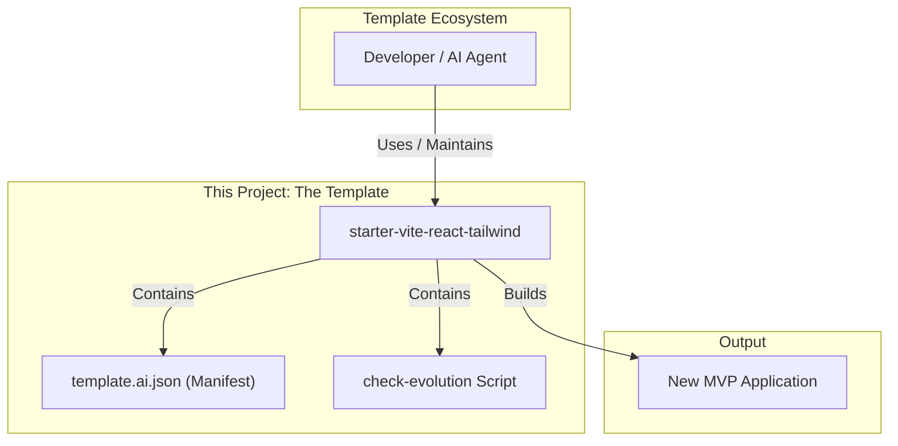

# starter-vite-react-tailwind Architecture Document

## Introduction

This document outlines the overall project architecture for the "starter-vite-react-tailwind". Its primary goal is to serve as the guiding architectural blueprint for AI-driven development, ensuring consistency and adherence to the chosen patterns and technologies. The file structures and configurations herein are intended to be implemented exactly as specified.

## Starter Template or Existing Project

The project will be initialized from scratch using `npm create vite@latest` with the React + TypeScript template. No external starter template repository will be used.

## Change Log

| Date          | Version | Description                 | Author              |
| ------------- | ------- | --------------------------- | ------------------- |
| June 25, 2025 | 1.1     | Updated template name.      | Winston (Architect) |
| June 25, 2025 | 1.0     | Initial draft based on PRD. | Winston (Architect) |

## High Level Architecture

### Technical Summary

This document specifies the architecture for a minimal, frontend-only React template built with Vite. The core design principles are simplicity, developer-friendliness, and machine-readability for AI agents. The architecture includes:

* TypeScript
* ESLint
* TailwindCSS (including dark mode)
* Functional example page
* `template.ai.json` manifest
* `check-evolution` script

### High Level Overview

The architecture is a standard client-side SPA structure generated by Vite. The repository is a single-package structure, not a monorepo. The design is un-opinionated beyond the core technology choices, providing a clean slate for MVP builds.

### High Level Project Diagram



## Architectural and Design Patterns

* **Component-Based Architecture**: Reusable React components
* **Theme Provider Pattern**: Context-based dark/light theme
* **Configuration-as-Code**: Vite, Tailwind, ESLint settings as config files

## Tech Stack

| Category      | Technology  | Version   | Purpose                       | Rationale                            |
| ------------- | ----------- | --------- | ----------------------------- | ------------------------------------ |
| Language      | TypeScript  | \~5.4.5   | Type safety for JS            | Reduces errors, improves AI accuracy |
| Runtime       | Node.js     | \~20.11.0 | Development environment       | LTS version required by Vite         |
| Framework     | React       | \~18.3.1  | UI library                    | Core frontend tech                   |
| Build Tool    | Vite        | \~5.2.0   | Dev server and bundler        | Fast performance and DX              |
| Styling       | TailwindCSS | \~3.4.3   | Utility-first CSS framework   | Rapid and consistent UI styling      |
| UI Components | ShadCN UI   | \~0.8.0   | Headless component primitives | Accessible, unstyled foundation      |
| Testing       | Jest & RTL  | latest    | Unit testing                  | Industry standard for React          |
| Linter        | ESLint      | \~8.57.0  | Code quality enforcement      | Consistency and AI-readability       |

## Data Models

The core data model is the schema for the `template.ai.json` manifest file.

### template.ai.json Schema

```json
{
  "$schema": "http://json-schema.org/draft-07/schema#",
  "title": "BMAD AI Template Manifest",
  "description": "A manifest file for describing a project template to an AI agent.",
  "type": "object",
  "required": ["manifestVersion", "template", "purpose", "stack", "features", "rules"],
  "properties": {
    "manifestVersion": {
      "description": "The version of the manifest schema itself.",
      "type": "string",
      "const": "1.0"
    },
    "template": {
      "description": "Information about the template.",
      "type": "object",
      "properties": {
        "name": { "type": "string", "const": "starter-vite-react-tailwind" },
        "version": { "type": "string", "pattern": "^\\d+\\.\\d+\\.\\d+$" }
      },
      "required": ["name", "version"]
    },
    "purpose": {
      "description": "The intended use-case for this template.",
      "type": "string",
      "const": "Rapid prototyping and proof-of-concept builds."
    },
    "stack": {
      "description": "Key technologies used in this template.",
      "type": "array",
      "items": {
        "type": "object",
        "properties": {
          "name": { "type": "string" },
          "version": { "type": "string" },
          "category": { "type": "string" }
        },
        "required": ["name", "version", "category"]
      }
    },
    "features": {
      "description": "A list of built-in features and capabilities.",
      "type": "array",
      "items": { "type": "string" }
    },
    "rules": {
      "description": "Core architectural or style rules for the AI to follow.",
      "type": "array",
      "items": { "type": "string" }
    }
  }
}
```

## Source Tree

```
starter-vite-react-tailwind/
│
├── public/                 # Static assets
│
├── src/
│   ├── components/         # Shared React components
│   │   ├── ThemeProvider.tsx
│   │   └── ThemeToggle.tsx
│   ├── lib/                # Utility functions
│   │   └── utils.ts
│   ├── App.tsx             # Main application component/router
│   └── main.tsx            # Application entry point
│
├── .env.example
├── .eslintrc.js
├── .gitignore
├── index.html
├── package.json
├── postcss.config.js
├── README.md
├── tailwind.config.js
├── template.ai.json
└── vite.config.ts
```

## Coding Standards & File Contents

### vite.config.ts

```ts
import path from "path"
import react from "@vitejs/plugin-react"
import { defineConfig } from "vite"

export default defineConfig({
  plugins: [react()],
  resolve: {
    alias: {
      "@": path.resolve(__dirname, "./src"),
    },
  },
})
```

### tailwind.config.js

```js
/** @type {import('tailwindcss').Config} */
module.exports = {
  darkMode: ["class"],
  content: [
    './pages/**/*.{ts,tsx}',
    './components/**/*.{ts,tsx}',
    './app/**/*.{ts,tsx}',
    './src/**/*.{ts,tsx}',
	],
  prefix: "",
  theme: {
    container: {
      center: true,
      padding: "2rem",
      screens: {
        "2xl": "1400px",
      },
    },
    extend: {
      colors: {
        'custom-primary': '#007BFF',
      },
      keyframes: {},
      animation: {},
    },
  },
  plugins: [require("tailwindcss-animate")],
}
```

### .eslintrc.js

```js
module.exports = {
  root: true,
  env: { browser: true, es2020: true },
  extends: [
    'eslint:recommended',
    'plugin:@typescript-eslint/recommended',
    'plugin:react-hooks/recommended',
  ],
  ignorePatterns: ['dist', '.eslintrc.js', 'vite.config.ts'],
  parser: '@typescript-eslint/parser',
  plugins: ['react-refresh'],
  rules: {
    'react-refresh/only-export-components': [
      'warn',
      { allowConstantExport: true },
    ],
  },
}
```

## Next Steps

### Developer Handoff

This Architecture Document is now complete. The next step is to use a Developer agent to implement the user stories outlined in the PRD. The agent should create the exact file structures and configurations specified in this document to build the V1 of the template.
