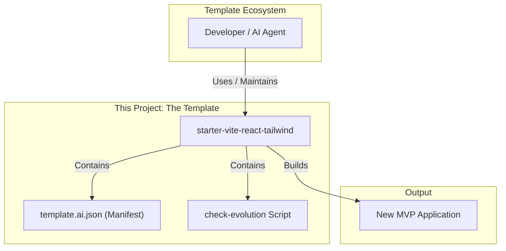

# High Level Architecture

## Technical Summary

This document specifies the architecture for a minimal, frontend-only React template built with Vite. The core design principles are simplicity, developer-friendliness, and machine-readability for AI agents. The architecture includes:

* TypeScript
* ESLint
* TailwindCSS (including dark mode)
* Functional example page
* `template.ai.json` manifest
* `check-evolution` script

## High Level Overview

The architecture is a standard client-side SPA structure generated by Vite. The repository is a single-package structure, not a monorepo. The design is un-opinionated beyond the core technology choices, providing a clean slate for MVP builds.

## High Level Project Diagram

